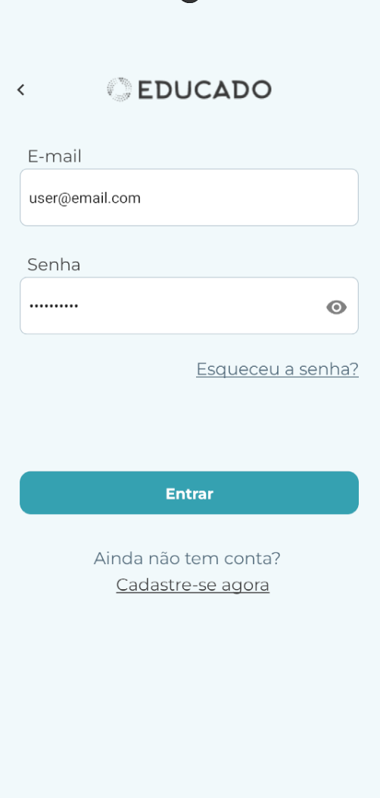

# [US-0003 Student Login](https://github.com/ErasmusEgalitarian/educado-mobile/issues/444)

## Overview  
A new interface for logging into the mobile application using email and password. 
Users need this page to be able to access their current courses and progress. 



## User Story  
As a Student, I want to see clear options for Email Login, so that I can quickly start using the app or create a secure account.

---

## What Was Implemented  
- The login screen was changed from using mobile phone number to instead use user email address to access the application. This involved changes to the mobile frontend so the application aligns with the GUI-figma. 
- Additionally, users can change their password using twofactor authenticaiton by accessing a secondary drawer.

- Involved components:
    - ```components/General/EducadoModal.tsx```
    - ```components/General/Forms/FormButton.tsx```
    - ```components/General/Forms/FormTextField.tsx```
    - ```components/Login/EnterNewPasswordScreen.tsx```
    - ```components/Login/LoginForm.tsx```
    - ```components/Login/ResetPassword.tsx```
    - ```screens/Login/LoginScreen.tsx```
---

## Impact  
The product now more closely aligns with the new designs for the user experience while using the GUI.

---

## Related Files / Modules  
- screens/Login/LoginScreen.tsx

---

## Next Steps  
Integration with the new database is pending. 

---

**Team:** [Group 8]  
**Date:** [16/10/2025]
