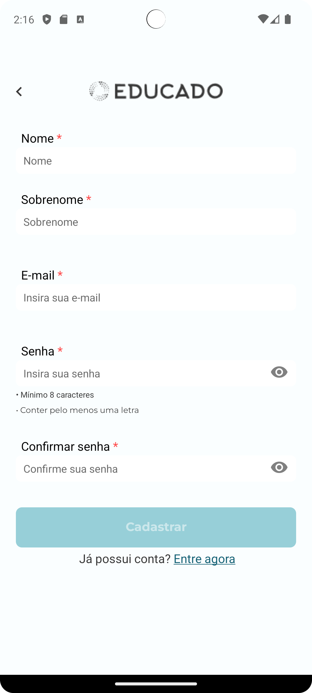

# [US-0065 Student Registration](https://github.com/ErasmusEgalitarian/educado-mobile/issues/442)

## Overview  

An update to the interface used for creating new users in the mobile application. Users provide their name, email, and password to register.

---

## User Story  
As a Student, I want to create an account with my name, email and password, so that I can securely access the app and personalize my profile.

---

## What Was Implemented  
- The GUI was updated to align with Figma-designs. 
- Field 'last name' was removed from the registration form. 

- Inved components
    - ```components/General/Forms/FormFieldAlert.tsx```
    - ```components/General/validation.ts```
    - ```components/Login/LoginForm.tsx```
    - ```screens/Login/LoginScreen.tsx```
---

## Impact  
The product now more closely aligns with the new designs for the user experience while using the GUI. 
Removing last name from the register form makes creating a new user simpler.

| Register Before | Register After |
|------------|-----------|
|  |  Insert after here |

---

## Related Files / Modules  
- ```screens/Login/LoginScreen.tsx```

---

## Next Steps  
Integration with new backend is pending as of 16/10/2025. See PBIs [US-0001 - Student Login] and [US-0066 - Student Registration]

---

**Team:** [Group 8]  
**Date:** [16/10/2025]
