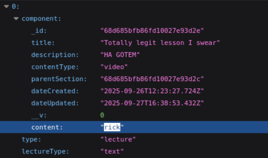

# Play Video Blocks

## Overview  
Fixes video playback.

### Error checking

```
const url = await getVideoURL(lecture.content, currentResolution);
const response = await axios.get(url, { method: "HEAD" });
const contentType = response.headers["content-type"] as string | null;
if (!contentType?.startsWith("video/")) {
    console.error(`Invalid URL: ${url}`);
    throw new Error("Invalid URL");
}
```

The database is a bit weird with how it handles files that don't exist. Instead of returning Error 404, it returns a text object describing the error. For that reason, we check the HEAD to see if it returns `video/` or anything else.

### Database
The codebase has different expectations for how videos should be stored compared to the database. In fact, none of the lessons in the database linked to any videos. So what we did was, for a lesson with `contentType: "video"`, the `content` field should be populated with the name of the video. It could also be an id to avoid collisions. 

 

The database should be remodelled, because `type` is unneeded. `lectureType` could either be text or exercise, never a video. And if it is a text, then there is `contentType` inside `component`, which determines if the lesson should be a text or a video.

### Issues

Due to the aformentioned discrepancy, there are some issues that were not fixed.

- All videos play as soon as one lesson loads. The logic is that all the cards are loaded in the background, and then shown accordingly. The videos are meant to play when they're shown and stop when they're hidden, but right now they auto play when they're loaded.

- Continue button goes to the next card, but does not update the position of the dots above. This I believe leads to some buggy behaviour. The continue button will soon be removed according to the Figma.

- `LectureScreen.tsx` is unneeded. `lectureType` should determine the type of the lesson, and then the `ComponentSwipeScreen.tsx` screen should render `VideoLecture.tsx`, not the `LectureScreen.tsx`, which in turn renders the `VideoLecture.tsx` component.

All issues could be fixed by updating `ComponentSwipeScreen.tsx`. Refer to [Next Steps](#next-steps).


---

## User Story  
As a Student, I want to play video blocks in lessons, so that I can watch lectures directly.

---

## What Was Implemented  
- Fixed the links to the database to load videos
- Updated the video player screen
- Deleted unnecessary components

 


---

## Impact  
The user can learn by watching videos, even if they can't properly read text.

---

## Related Files / Modules  
- `VideoLecture.tsx`
- `LectureScreen.tsx`
- `ComponentSwipeScreen.tsx` (indirectly / not changed)

---

## Next Steps  
The next step would be to fix the issues described above. The ideal plan of action would be to first integrate Strapi into the mobile application, then make sure the code follows its models, then fix the whole lesson pipeline, and finally to add an Effect in `ComponentSwipeScreen.tsx` that plays/stops a video if the user is on this/different lesson card. Use `videoRef` to control the video's playback.

The Figma design should be implemented after fixing the lesson pipeline at least.

---

**Team:** [Group 5]  
**Date:** [10/22/2025]
