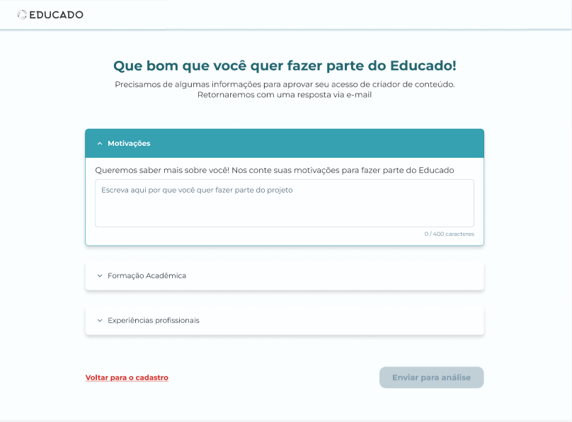
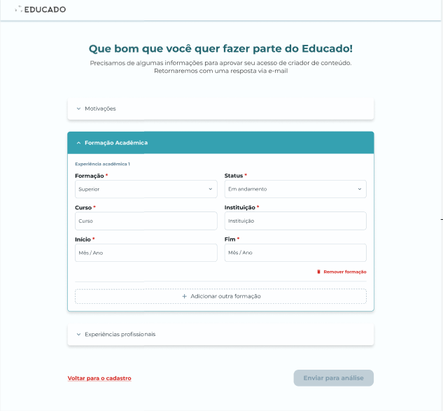

# [Content Creator Registration](https://github.com/ErasmusEgalitarian/educado-backend/issues/24)

## Overview  
Login for content creators implemented and updated to work with the new backend.

---

## User Story  
As a Content Creator, I want to register using my email, so that I can access the platform and publish courses.

---

## What Was Implemented  
- Registration has been updated to use predefined Tailwind colors instead of hexcode
- The frontend part has been updated to use reusable components from the shared components
- Uses the new strapi backend 
- Registration now has an extra page for gathering additional information about the user


---

## Impact  
The product now more closely aligns with the figma in terms of design. 

Additionally a new page with forms have been added, these forms are split into three categories:

### Motivation
On this page it is possible for the content creator to fill in their Motivation for using Educado




### Academic Training
In this form it is possible for the user to fill in their education, at the bottom of the form there is a button to add another education




### Professional Experience 
In the last form of the page, it is possible to add work experience, here the user can fill out when they had a particular job and what their role was at the job. Additionally it is also possible to add a short description of their activities, as well as adding more job forms.


---

## Related Files / Modules  
### web files
- ```features/auth/components/pages/signup.tsx ```
- ```features/auth/components/pages/signup-information.tsx ```
- ```features/auth/components/signup/micro-services.tsx ```  
- ```features/auth/components/signup/signup-cards.tsx ```  
- ```features/auth/components/signup/signup-form-schema.tsx ```  
- ```src/unplaced/services/auth.services.ts ```
- ```src/index.css ```
- ```src/App.tsx```


### Backend files
- ```api/content-creator/controllers/content-creator.ts ```
- ```api/content-creator/routes/custom-content-creator.ts ```


---

## Next Steps  
TBD

---

**Team:** [Group 1]  
**Date:** [11/14/2025]
