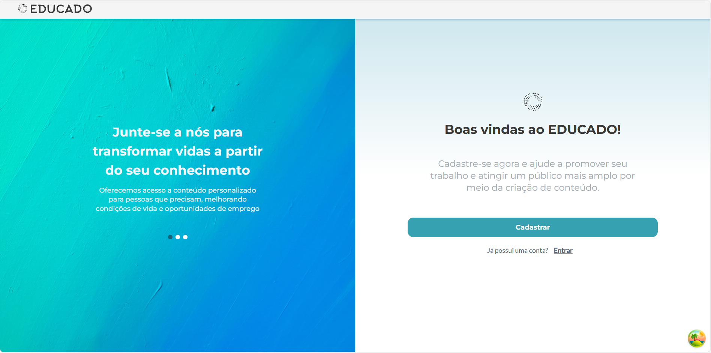
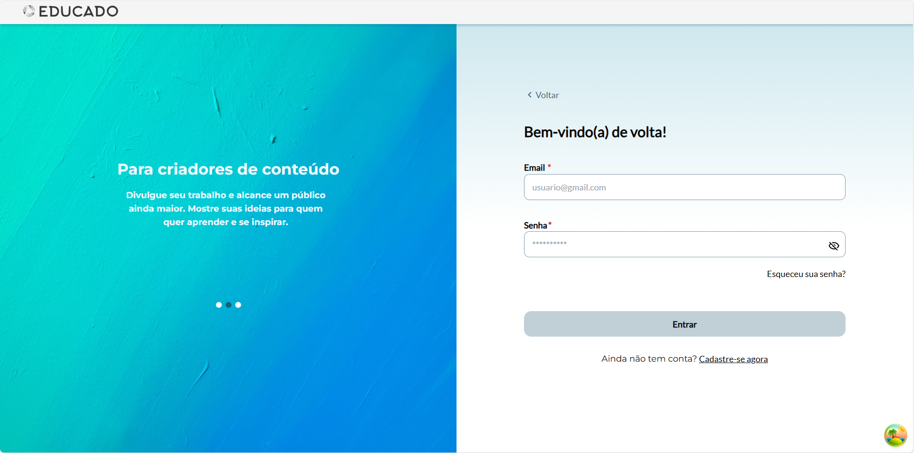
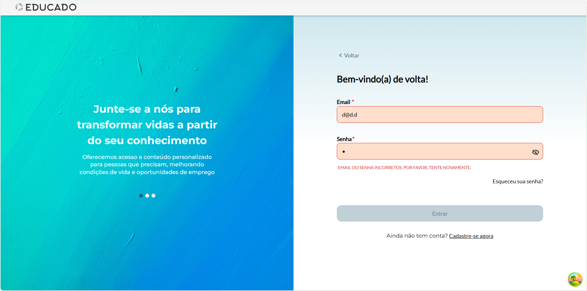

# [Content Creator Login]

## Overview  
The websites UI have been updated to follow the figma and it now works with the new backend.
This makes it possible for Content Creator to login, and helps identify errors if they e.g. haven't been verified or typed their password or mail wrong.

---

## User Story  
As a Content Creator, I want to log in with my credentials, so that I can manage my courses.

---

## What Was Implemented  
- Creators can enter their email and password.
- If their account is approved → access is granted. 
- If their account is pending → a message will be shown that admin approval is required.
- And invalid credentials will be blocked.
- The message rotator called caroulsel, login page and welcome page has been updated to fit the figma design with the new messages

---

## Impact  
This improves the product by granting the Content creator the ability to login

---

## Related Files / Modules  
- Login.tsx  
- auth-provider.tsx
- userInfo.ts
- Welcome.tsx
- auth-context.ts
- GenericModalComponent.tsx
- en.json
- pt.json

---

## Next Steps  
password recovery

---

**Team:** group 1
**Date:** [11/14/2025]
