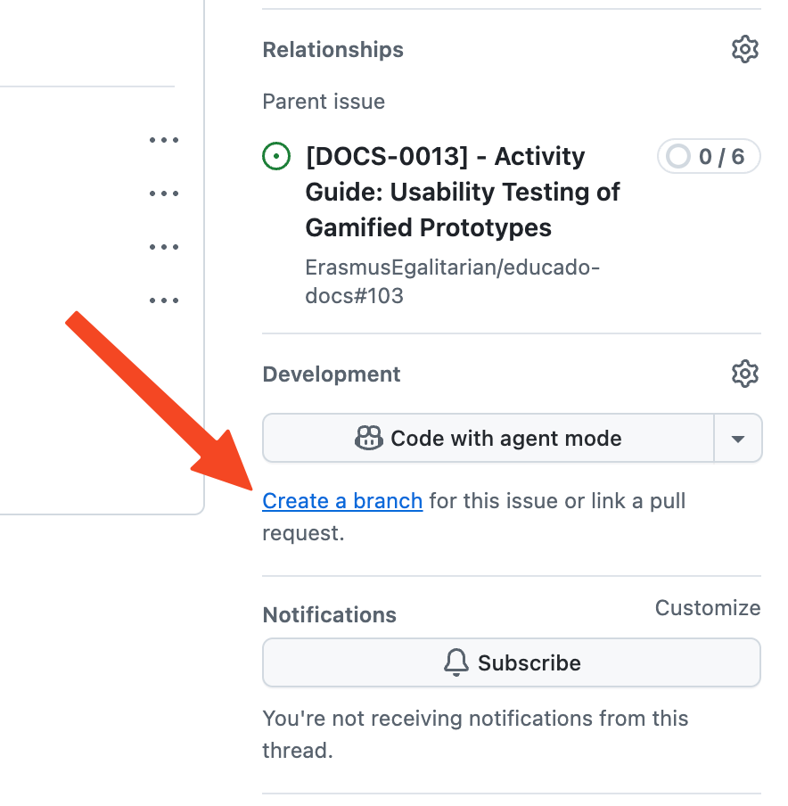

## Branching

Create a branch from `main`. It is advised to use the `Create a branch` button in the GitHub Issue UI as it will name
the branch according to the issue you are working on.

{: style="height:300px"}

## Required changes

Always update `CHANGELOG.md` and `pyproject.toml` before opening a PR. The versions in these files need to be updated
in every PR and should match. We use [semantic versioning](https://semver.org/) for versioning, and the changelog
adheres to [Keep a Changelog](https://keepachangelog.com/en/1.1.0/).

## Pull requests

### Merging

After a PR is merged into `main`, the documentation will be automatically deployed to the
[Educado Documentation](https://erasmusegalitarian.github.io/educado-docs/) via a commit the `gh-pages` branch, while
`main` will be tagged with the version set in `pyproject.toml` and the latest entry in `CHANGELOG.md`.
