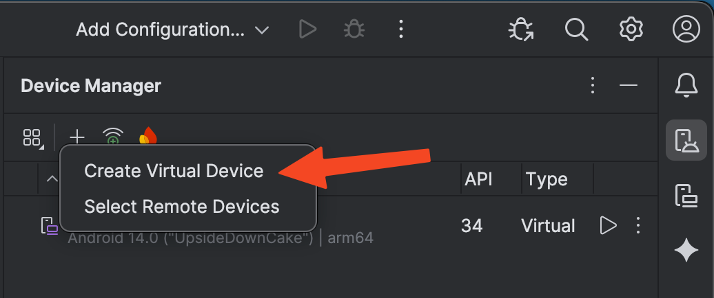
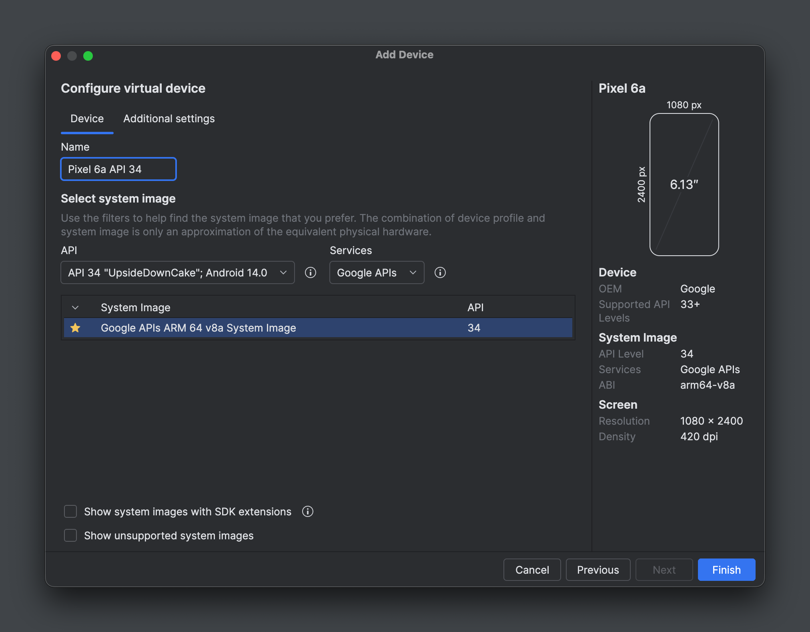
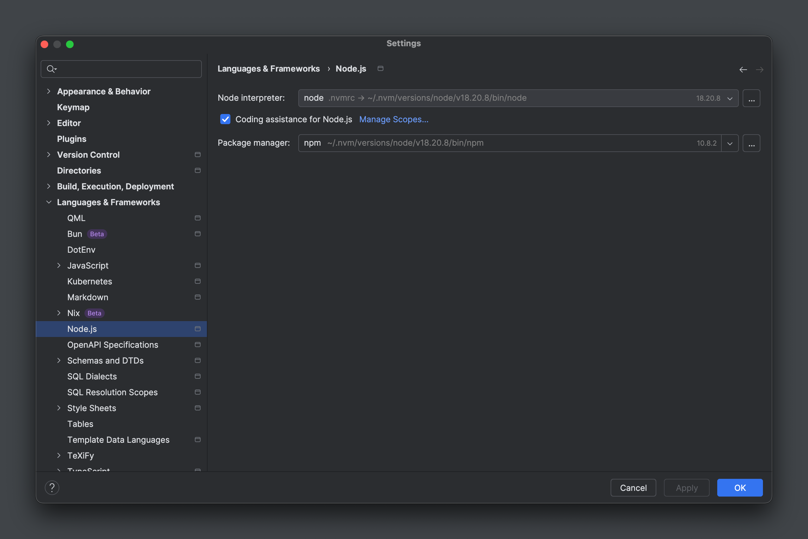
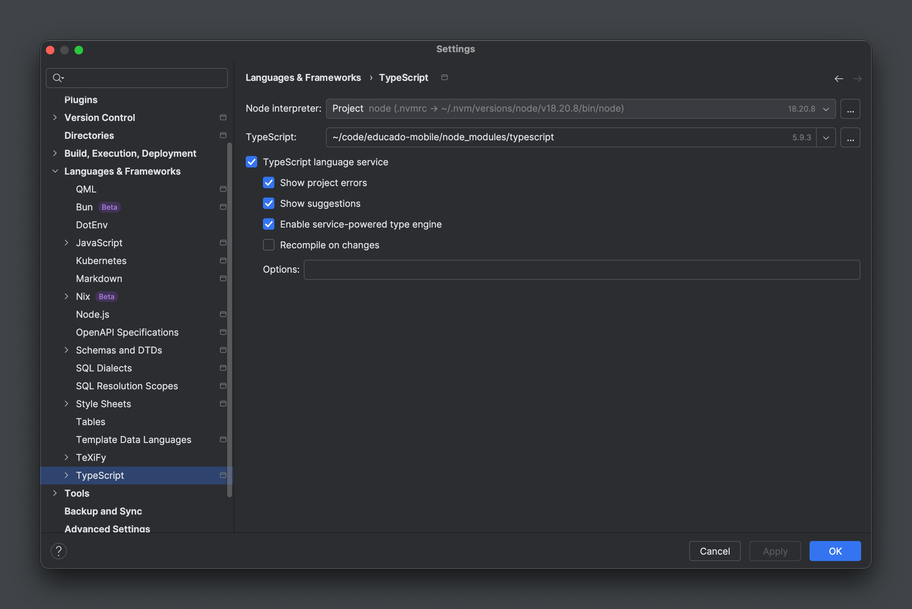
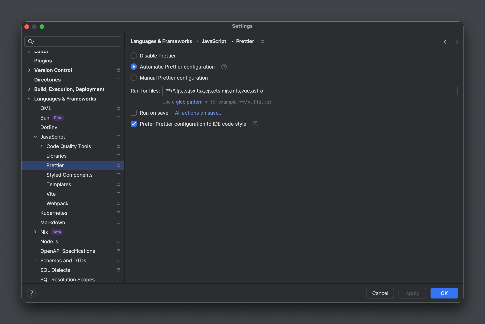

## Prerequisites

### Common

- JetBrains account: As a student you can [create a JetBrains account](https://www.jetbrains.com/academy/student-pack/)
  and get all products for free.
- [JetBrains Toolbox](https://www.jetbrains.com/toolbox-app/)
    - JetBrains WebStorm (downloaded through Toolbox, for editing code)
    - JetBrains/Google Android Studio (downloaded through Toolbox, **only** for setting up emulators and managing the
      Android SDK)
- Git
    - SSH authentication (optional). See the
      [GitHub docs](https://docs.github.com/en/authentication/connecting-to-github-with-ssh/generating-a-new-ssh-key-and-adding-it-to-the-ssh-agent).
      If you use SSH, you need to clone the project using SSH by running
      `git clone git@github.com:ErasmusEgalitarian/educado-mobile.git` so Git properly connects to GitHub using SSH.
    - Set up Git to use your GitHub login username and email with the `user.name` and `user.email` configuration
      settings. See the GitHub docs about setting up
      [`user.name`](https://docs.github.com/en/get-started/git-basics/setting-your-username-in-git)
      and
      [
      `user.email`](https://docs.github.com/en/account-and-profile/how-tos/setting-up-and-managing-your-personal-account-on-github/managing-email-preferences/setting-your-commit-email-address).
- Docker (optional)
- A cup of coffee and patience

### Linux/macOS

- [nvm](https://github.com/nvm-sh/nvm)

### Windows

- [nvm-windows](https://github.com/coreybutler/nvm-windows)

!!! note

    After installing nvm, remember to check if the snippet was added to your shell profile (`.bashrc`, `.zshrc`, etc.) 
    and restart your terminal.

## Install Node.js

nvm reads the `.nvmrc` file in the project root to determine the Node.js version to install. In the project root
(`educado-mobile`), run:

### macOS/Linux

```shell
nvm install
nvm current # Verify version
```

### Windows

```powershell
$ver = Get-Content .nvmrc
nvm install $ver
nvm current # Verify version
```

## Install dependencies

Run:

```shell
npm install
```

!!! warning

    You will have to run this command every time you switch branches or pull changes from the remote. Keep an eye on
    PRs, as a change in the `package.json` and/or `package-lock.json` files requires you to run this command again.

## Environment variables

Copy the contents of `.env.local.sample` into a new file called `.env.local` and add the variable values to this new
file. You will find the values in `# mobile` on Discord or use the hostname of your locally running back-end instance.
Never add `.env.local` to VCS (it's ignored anyway). Never use `.env` as it's meant for shared production values that
should be added to VCS, e.g., feature flags. See the [Expo docs](https://docs.expo.dev/guides/environment-variables/)
for more information.

## Emulator setup

Upon opening Android Studio for the first time, go through the installation process and install the Android SDK and
Android Virtual Device (AVD) when prompted.

Additionally, you will need to install the Android SDK Build Tools and Android SDK Platform Tools.
See [this guide](https://docs.expo.dev/workflow/android-studio-emulator/) for more information.

!!! note "Windows"

    Steps 8 and 10 of the [guide above](https://docs.expo.dev/workflow/android-studio-emulator/#set-up-android-studio)
    can actually be simplified and done in PowerShell. As administrator, run:

    ```powershell
    $Sdk = "$env:LOCALAPPDATA\Android\Sdk"
    setx ANDROID_HOME $Sdk
    setx ANDROID_SDK_ROOT $Sdk
    setx PATH "$env:PATH;$Sdk\platform-tools;$Sdk\emulator"
    ```

Open the `Device Manager` tool window, then click on `Add a new device` and select `Create Virtual Device`.

{: style="height:250px"}

Then select `Medium Phone` and click `Next`. Name it `Medium Phone API 34`, select `API 34 "UpsideDownCake"`, select the
Google Play image and click `Finish`.

{: style="height:500px"}

The emulator should now show up in the Device Manager. Click the play button to start it to make sure it works. You can
now close the emulator and exit out of Android Studio.

## Expo account

Go to [expo.dev](https://expo.dev/signup) and create an account. Send your username to Martin Kedmenec (Discord:
`@kedgmenec`) to be added to the Educado Expo organization. Then, in the project root, run `npx expo login` and log in
using your credentials. Run `npx expo whoami` to verify that you are logged in.

## Running the emulator

Run `npx expo start`. When the QR code appears:

- Press `a` to open the default emulator.
- Press `shift + a` to choose from all available emulators. Choose the emulator you have created
  (`Medium Phone API 34`).

A window should now pop up with the emulator.

!!! tip

    If you have trouble getting Expo to bundle or refresh the app, try reloading the app by pressing `r` in the emulator
    server menu.

    You can also try to run the server with `npx expo start -c` which will clear the cache before starting the emulator.

## IDE setup

### Android Studio

You won't really need Android Studio for development because this is a TypeScript-first project, but you will need it
for managing the Android SDK.

### WebStorm

WebStorm will automatically read the shared project configuration from the `.idea/` directory and a couple of other
configuration files like e.g., `.editorconfig`. But there are some additional settings that you need to configure. You
can configure the settings as shown on the images below.

{: style="height:500px"}

{: style="height:500px"}

{: style="height:500px"}

{: style="height:500px"}

### Visual Studio Code

WebStorm is the recommended IDE for this project due to the additional refactoring features that it offers. If you, for
any reason, can't use WebStorm, you can use Visual Studio Code as a fallback. However, this setup won't be as supported
as WebStorm, as managing two or three additional local development setups on top of WebStorm is unfeasible.

Having said that, if you use Visual Studio Code, it will read the project configuration from the `.vscode/` directory.
The editor will ask you to install the recommended extensions, which you can do by clicking on the `Install all` button
in the bottom right corner.
