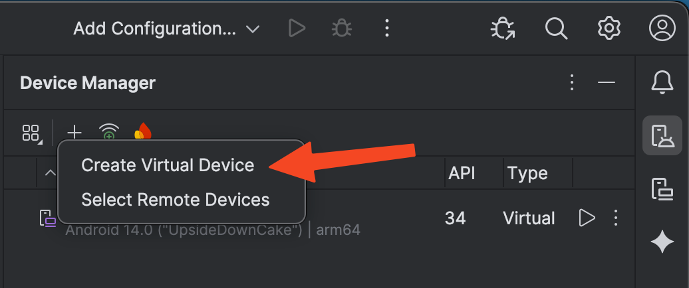
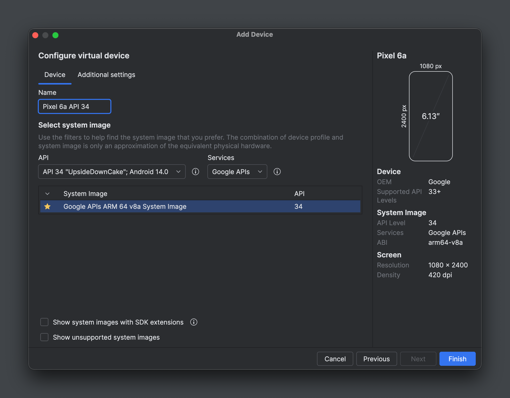
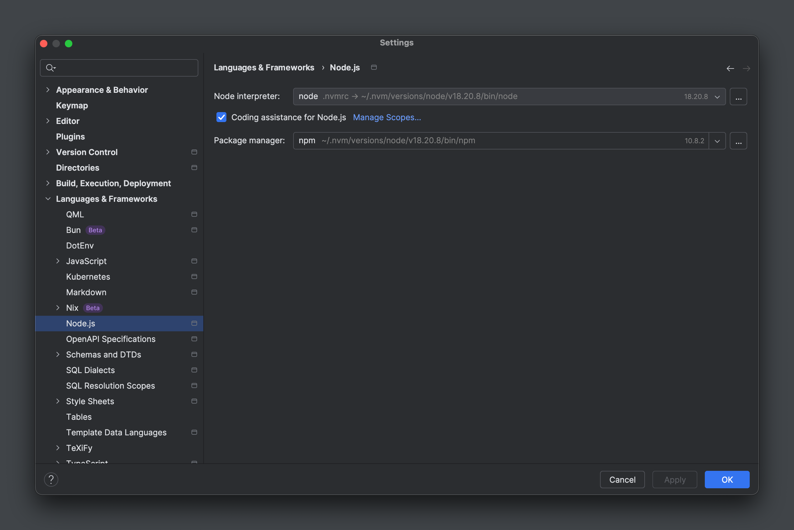
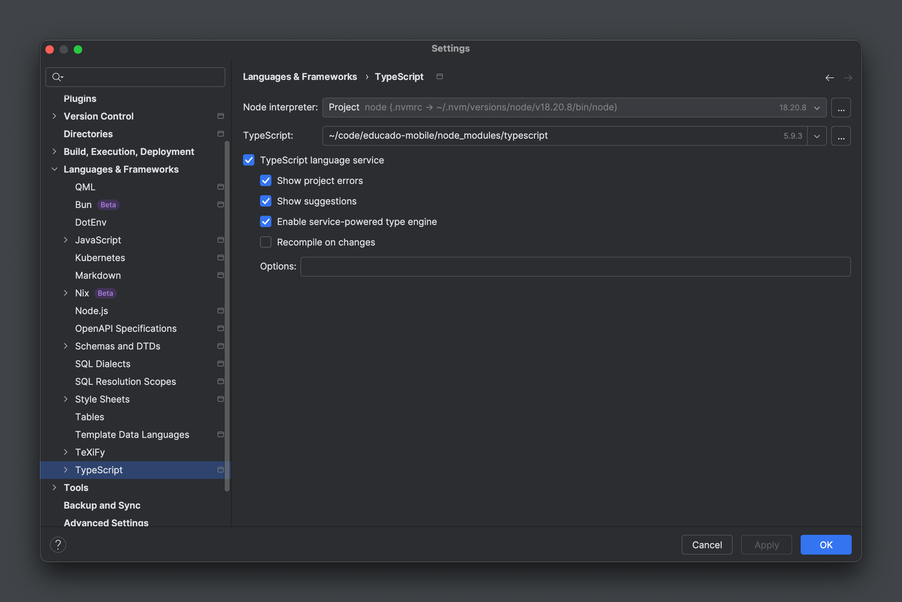
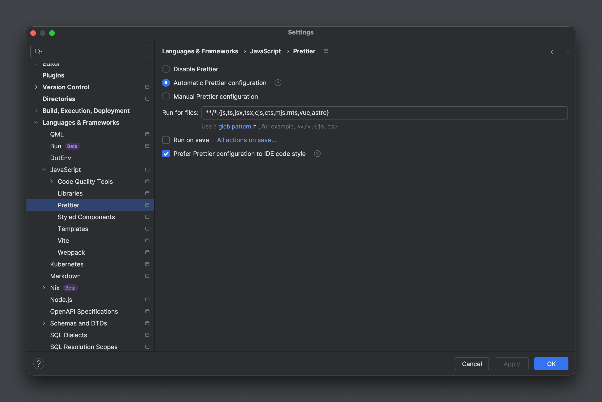
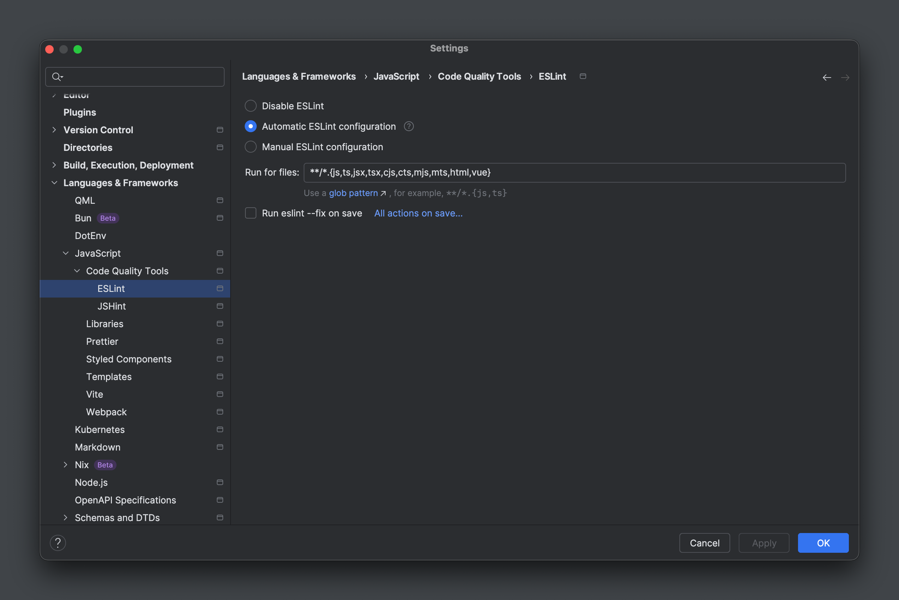

## Prerequisites

### Common

- JetBrains account: As a student you can [create a JetBrains account](https://www.jetbrains.com/academy/student-pack/)
  and get all products for free.
- [JetBrains Toolbox](https://www.jetbrains.com/toolbox-app/)
    - JetBrains WebStorm (downloaded through Toolbox, for editing code)
    - JetBrains/Google Android Studio (downloaded through Toolbox, **only** for setting up emulators and managing the
      Android SDK)
- Git
    - SSH authentication (optional). See the
      [GitHub docs](https://docs.github.com/en/authentication/connecting-to-github-with-ssh/generating-a-new-ssh-key-and-adding-it-to-the-ssh-agent).
      If you use SSH, you need to clone the project using SSH by running
      `git clone git@github.com:ErasmusEgalitarian/educado-mobile.git` so Git properly connects to GitHub using SSH.
    - Set up Git to use your GitHub login username and email with the `user.name` and `user.email` configuration
      settings. See the GitHub docs about setting up
      [`user.name`](https://docs.github.com/en/get-started/git-basics/setting-your-username-in-git)
      and
      [
      `user.email`](https://docs.github.com/en/account-and-profile/how-tos/setting-up-and-managing-your-personal-account-on-github/managing-email-preferences/setting-your-commit-email-address).
- Docker (optional)
- A cup of coffee and patience

### Linux/macOS

- [nvm](https://github.com/nvm-sh/nvm)
- [SDKMAN!](https://sdkman.io/)

!!! note

    After installing nvm, remember to check if the snippet was added to your shell profile (`.bashrc`, `.zshrc`, etc.) 
    and restart your terminal.

### Windows

- [nvm-windows](https://github.com/coreybutler/nvm-windows)
- [Chocolatey](https://chocolatey.org/)

## Install Java

### macOS/Linux

SDKMAN! reads the `.sdkmanrc` file in the project root to determine the Java version to install. In the project root
(`educado-mobile`), run:

```shell
sdk env install
```

### Windows

In Windows Terminal (PowerShell), run:

```powershell
choco install -y microsoft-openjdk17
```

## Install Node.js

nvm reads the `.nvmrc` file in the project root to determine the Node.js version to install. In the project root
(`educado-mobile`), run:

### macOS/Linux

```shell
nvm install
nvm use
nvm current # Verify version
```

### Windows

```powershell
$ver = Get-Content .nvmrc
nvm install $ver # This command will output a command that you have to run in the next step
nvm use [VERSION] # Run the command that was outputted by the previous command
nvm current # Verify version
```

## Install dependencies

Run:

```shell
npm install
```

!!! warning

    You will have to run this command every time you switch branches or pull changes from the remote. Keep an eye on
    PRs, as a change in the `package.json` and/or `package-lock.json` files requires you to run this command again.

## Environment variables

Copy the contents of `.env.local.sample` into a new file called `.env.local`, place it in the root of the local
`educado-mobile` project, and add the variable values to this new file. You will find the values in `# mobile` on
Discord or use the hostname of your locally running back-end instance. Never add `.env.local` to VCS (it's ignored
anyway). Never use `.env` as it's meant for shared production values that should be added to VCS, e.g., feature flags.
See the [Expo docs](https://docs.expo.dev/guides/environment-variables/) for more information.

!!! danger

    Keep in mind that the values in the `.env.local` file shared on Discord are pointing to the **deployed** staging
    environment. This means that you are working with a live version of the app and potentially editing data that will
    affect other developers.

## Emulator setup

Upon opening Android Studio for the first time, go through the installation process and install the Android SDK and
Android Virtual Device (AVD) when prompted.

Additionally, you will need to install the Android SDK Build Tools and Android SDK Platform Tools.

Follow
[this guide](https://docs.expo.dev/get-started/set-up-your-environment/?platform=android&device=simulated&mode=development-build&buildEnv=local)
(Android emulator, development build). It is crucial that you install all the Android SDK components shown in the guide.

!!! note "Windows"

    Steps 8 and 10 of the
    [guide above](https://docs.expo.dev/get-started/set-up-your-environment/?platform=android&device=simulated&mode=development-build&buildEnv=local)
    can actually be simplified and done in Windows Terminal (PowerShell). As administrator, run:

    ```powershell
    $Sdk = "$env:LOCALAPPDATA\Android\Sdk"
    setx ANDROID_HOME $Sdk
    setx ANDROID_SDK_ROOT $Sdk
    setx PATH "$env:PATH;$Sdk\platform-tools;$Sdk\emulator"
    ```

In Android Studio, under `Settings | Languages & Frameworks | Android SDK | SDK Platforms`, you also need to mark the
Android 14 components matching the Android 15 components shown in the guide. In total, you should have the following
components installed on top of the preinstalled components:

- `Android 15.0 ("VanillaIceCream")`
    - `Android SDK Platform 35`
    - `Sources for Android 35`
    - `Google APIs Intel x86_64 Atom System Image` or `Google APIs ARM 64 v8a System Image` (depends on your
      architecture)
    - `Google Play Intel x86_64 Atom System Image` or `Google Play ARM 64 v8a System Image` (depends on your
      architecture)
    - `Pre-Release 16 KB Page Size Google Play Intel x86_64 Atom System Image` or
      `Pre-Release 16 KB Page Size Google Play ARM 64 v8a System Image` (depends on your
      architecture)
- `Android 14.0 ("UpsideDownCake")`
    - `Android SDK Platform 34`
    - `Sources for Android 34`
    - `Google APIs Intel x86_64 Atom System Image` or `Google APIs ARM 64 v8a System Image` (depends on your
      architecture)
    - `Google Play Intel x86_64 Atom System Image` or `Google Play ARM 64 v8a System Image` (depends on your
      architecture)

Open the `Device Manager` tool window, then click on `Add a new device` and select `Create Virtual Device`.

{: style="height:250px"}

Then select `Pixel 6a` and click `Next`. Name it `Pixel 6a API 34`, select `API 34 "UpsideDownCake"`, select the Google
APIs image, and click `Finish`.

{: style="height:500px"}

The emulator should now show up in the Device Manager. Click the play button to start it to make sure it works. You can
now close the emulator and exit out of Android Studio.

## Expo account

Go to [expo.dev](https://expo.dev/signup) and create an account. Send the email you used to create your account to
Cecilie Vebner (Discord: `ceciv`) to be added to the Educado Expo organization. Then, in the project root, run
`npx expo login` and log in using your credentials. Run `npx expo whoami` to verify that you are logged in.

## Running the emulator

### Development build

#### First run

Run `npx expo run:android`. A window should now pop up with the emulator. The first time you run the app, it will take a
while to compile the code and install it on the emulator.

When the app is ready, you should see the app running on the emulator. An `android/` directory should have been created
in the project root. This directory contains the Android build files.

!!! note

    You only need to run `npx expo run:android` once or in the following cases:

    - `package.json` or `package-lock.json` have been changed
    - Assets and configurations like the app icons, splash screen, manifest, or permissions have changed
    - The Expo version, Android SDK, or emulator configuration have changed

#### Subsequent development sessions

Run `npx expo start`. When the QR code appears, press `a` to open the default emulator or press `shift + a` to choose
from all available emulators. Choose the emulator you have created (`Pixel 6a API 34`).

!!! warning "Windows"

    If you have trouble running the app, get some connection or Metro issues, open a new Windows Terminal (PowerShell)
    tab and run `adb reverse --list`. If the output is empty, or shows connection errors, run
    `adb reverse tcp:8081 tcp:8081`. The output of the latter command should now show that the port is being forwarded.
    Go back to the emulator and try to refresh the app.

!!! tip

    If you have trouble getting Expo to bundle or refresh the app, try reloading the app by pressing `r` in the server
    menu.

    You can also try to run the server with `npx expo start -c` which will clear the cache before starting the emulator.

### Expo Go

Expo Go is the legacy method of running the app on Android. It is not recommended for development. You can read more
about the pros and cons of Expo Go and how it compares to development builds in the
[Expo docs](https://docs.expo.dev/develop/development-builds/introduction/).


## IDE setup

### Android Studio

You won't really need Android Studio for development because this is a TypeScript-first project, but you will need it
for managing the Android SDK.

## EAS Build

EAS Build is an Expo tool for generating app binaries (.apk, .aab, .ipa) for Expo and React Native projects to be deployed in
the Apple App Store or Google Play Store.

We use EAS Build to deploy the Educado app on the Google Play Store by building an .aab production file.

### Set up EAS

First, ensure that you have followed the steps in [this section](https://erasmusegalitarian.github.io/educado-docs/handbook/mobile/getting-started/#expo-account) to join the new Educado Expo organisation.
Then run the following commands:

    npm install -g eas-cli

    eas login

    eas whoami 

### Building the project

In the `eas.json` file, we have defined the different builds: preview, production, dev.


#### Development build:
The development build is used for active development and debugging. It generates an .apk file that can be tested on the emulator.
It connects the app via Metro bundler.

When creating a development build, first run `npx expo install expo-dev-client ` which is used for local testing and debugging. 
This command is not necessary for production builds.

    eas build --platform android --profile dev --local

#### Production build:
The production build is used for generating the .aab that will be published to the Google Play Store.

    eas build --platform android --profile production --local


!!! warning "Windows"

    This has only been confirmed to work for Linux and MacOS.
    Building locally is not supported by Windows. 

It is also possible to build in the cloud on EAS servers by removing `--local`. However, this has limitations such as:
*  Maximum of 30 builds per month
*  Maximum build duration of 2 hours
*  Maximum of 60 minutes of CI checks per month

!!! tip

    If your build fails run: `eas build:configure` before trying to build again.


## Updating the Educado app

Ensure there is an android directory, if not run `npx expo run:android`

#### 1) Delete the existing Educado app.
This can be done manually on the emulator. Tap on the app and hold it in, then drag it to the top right of the screen where it says uninstall.

#### 2) Create .apk file for development build
If you have not set up EAS, follow the steps for EAS Build.
Else, run the following command: `eas build --platform android --profile dev --local`
This should build an .apk file.

#### 3) Install the new Educado app
You can install the updated version of the app by manually dragging the built .apk file into the phone emulator.

#### 4) Run the app
Start the app as usual with `npx expo start`

The app should now be installed with the updated app icon and Educado logo. You can then discard your changes (discarding the .apk file) as this will now be the default version installed on your emulator.


### WebStorm

WebStorm will automatically read the shared project configuration from the `.idea/` directory and a couple of other
configuration files like e.g., `.editorconfig`. But there are some additional settings that you need to configure. You
can configure the settings as shown on the images below.

{: style="height:500px"}

{: style="height:500px"}

{: style="height:500px"}

{: style="height:500px"}

### Visual Studio Code

WebStorm is the recommended IDE for this project due to the additional refactoring features that it offers. If you, for
any reason, can't use WebStorm, you can use Visual Studio Code as a fallback. However, this setup won't be as supported
as WebStorm, as managing two or three additional local development setups on top of WebStorm is unfeasible.

Having said that, if you use Visual Studio Code, it will read the project configuration from the `.vscode/` directory.
The editor will ask you to install the recommended extensions, which you can do by clicking on the `Install all` button
in the bottom right corner.
