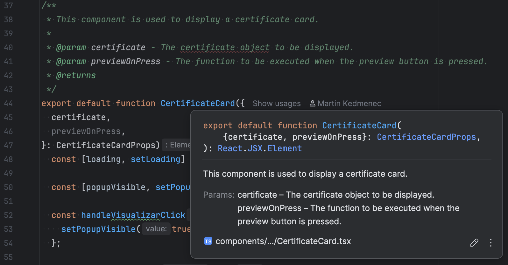

## Use `PascalCase` for component names, files, and directories

**Rationale**: This is the Expo standard.

Example: Component `MyClassyList` is in `components/Courses/MyClassyList.tsx`.

## Use `kebab-case` for regular TypeScript files and directories

**Rationale**: This is the TypeScript standard.

Example: `services/certificate-service.ts`.

## Use the Expo notation in the `app/` directory

**Rationale**: This is the Expo standard. Read more [here](https://docs.expo.dev/router/basics/notation/).

Example: `app/_layout.tsx`.

## Name tests `FILENAME-test.{ts,tsx}`

**Rationale**: This is the Expo standard.

Example: `LeaveButton-test.tsx`

## Match component file names to component names

**Rationale**: Components are easier to find.

Example: Component `CompleteCourseScreen` is in `CompleteCourseScreen.tsx`

## Use arrow functions

**Rationale**: This is the modern JavaScript/TypeScript approach to function declaration.

## Use [TSDoc](https://tsdoc.org/) for function documentation

**Rationale**: Proper function documentation is very helpful and TSDoc can be read by IDEs. You will be able to read the
function documentation at the call site in the IDE. See the example below.

{: style="height:300px"}

## Use `.tsx` for components, `.ts` for other files

**Rationale**: Always prefer TypeScript extensions and match them to the purpose of the file. Unless a file contains
JSX code (e.g., code like `<Component />`), it doesn't need to use the `.tsx` extension.

## Never do `import React from "react";`

**Rationale**: The new JSX transform (React 17+) doesn't require importing React in scope. React doesn't need to be in
scope. Importing React is usually unused noise; omit it to keep files clean.

## Use absolute imports

**Rationale**: Absolute imports are more readable and easier to refactor.

Example: `import { getUserInfo } from "@/services/storage-service";` instead of
`import { getUserInfo } from "../../../services/storage-service";`.

## Only use named exports

**Rationale**: Named imports require the imported symbol to have the same name as the exported symbol. This eases
finding components and files.

Example:

```tsx
const MyComponent = () => {
    // Component body goes here
};

export {MyComponent};
```

!!! note

    Currently, there are many default exports in the codebase. We should migrate them to named exports as soon as
    possible.

## Use descriptive, full names

**Rationale**: `NavigationBar` is more readable than `NavBar`. `WelcomeScreenAcceptButton` is more descriptive than
`GreenButton`.

## Only one component per file

**Rationale**: Smaller files mean fewer merge conflicts, easier editing, easier deletion.

!!! note

    Tiny internal helpers are okay if they're tightly coupled and not reused.

## Use the Android emulator and correct Android API version

**Rationale**: The end users use Android devices, and we should develop on and target this platform. Using the Android
emulator gives us the opportunity to emulate real Android hardware and scenarios. Also, all developers should develop on
the same platform. The platform should match the Expo and system requirements. Currently, we use Expo 50, Node.js 18 and
Android SDK 34, but we will upgrade to Expo 54, Node.js 24 and Android SDK 35 after we finish the first phase of the
upgrade. Read more under [Getting Started](./getting-started.md).

## Use nvm or Docker for local development

**Rationale**: See previous point.

## Never use PropTypes, use the TypeScript type system

**Rationale**: The `prop-types` package is an ancient, deprecated way of typing props. Always use TypeScript interfaces.

## Use localization

**Rationale**: Never hardcode values, especially not locale-specific string. Make them dynamic, so developers can switch
language. This doesn't mean that the end users will be able to switch languages. We will lock the deployed app to
Brazilian Portuguese. Read more in the [Expo docs](https://docs.expo.dev/guides/localization/).

## Only use the Expo CLI to install dependencies

**Rationale**: Expo is very picky about dependencies and has its own package management interface `npx expo install`.
Always prefer it to direct `npm` calls whenever possible. Read more in the
[Expo docs](https://docs.expo.dev/more/expo-cli/#install).

## Never import the Tailwind config into a component

**Rationale**: The bundle size explodes when the Tailwind config is imported into a component. Import color tokens
directly or create custom Tailwind classes.

**Bad**:

```tsx
import tailwindConfig from "../../tailwind.config.js";

const tailwindColors = tailwindConfig.theme.colors;
```

**Worse**:

```tsx
const tailwindConfig = require("../../../tailwind.config.js");

const projectColors = tailwindConfig.theme.colors;
```

**Good**:

```tsx
import {colors} from "@/theme/tokens";

export default function BackgroundLinearGradient({children}) {
    return (
        <LinearGradient
            colors={[colors.bgPrimary, colors.projectWhite]}
// ...
```

!!! note

    Refactor `tailwind.config.js` imports to a tokens import when you see it.

## Read the official documentation

**Rationale**: The official
[Expo](https://docs.expo.dev/), [Nativewind](https://www.nativewind.dev/), [Jest](https://jestjs.io/),
[TypeScript](https://www.typescriptlang.org/), and [Axios](https://axios-http.com/) docs will get you far, very far.

## Use standard commit messages

**Rationale**: GitHub reads keywords in commit messages and closes issues when a PR is merged that contains commit
messages that use those keywords. Furthermore, adding the issue ID to the commit message links the commit to the issue.
Finally, your commit message should finish the sentence: `If applied, this commit will [your commit message goes here]`.

Example: `Fix #34. Add the new welcome banner`. This commit message will link this commit to issue #34 and close this
issue when the commit is merged.

## Communicate, communicate, communicate

**Rationale**: We need to work efficiently and with a high cadence. Surprises are not as good as knowledge. Be kind to
each other.

Example: Follow what's going on GitHub, check PRs, ask questions, ask questions on Discord and follow `# mobile`, read
the docs and update them if necessary.

## Only commit what you actually worked on

**Rationale**: Random changes shouldn't be included in VCS. Don't blindly use `git add .`. Use `git status` to check
which files Git detects as modified. Only `git add` what you actually want to add.
