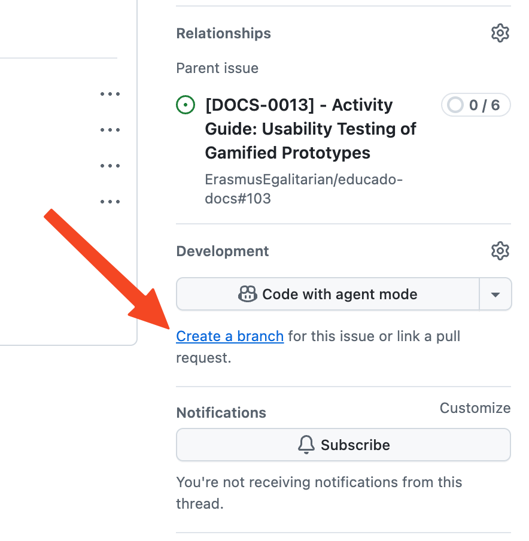
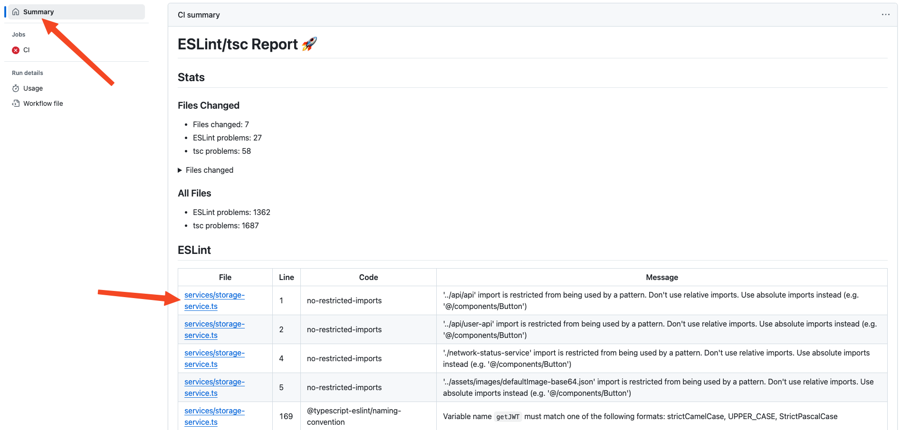
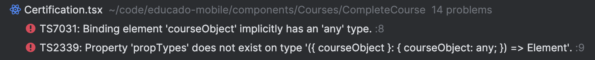
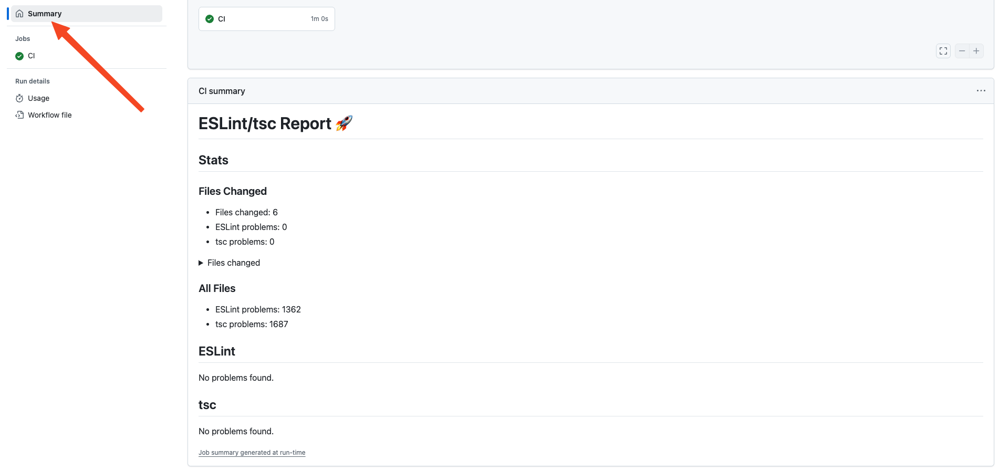

## Branching

Create a branch from `dev`. It is advised to use the `Create a branch` button in the GitHub Issue UI as it will name the
branch according to the issue you are working on.

{: style="height:300px"}

## Linear history

Keep your branch up to date. Do this **frequently**. There will be a lot of upstream changes (`dev` on GitHub) and you
want to make sure that your branch includes those changes even while you are working, and before you open a PR. In this
way, merge conflicts are reduced to a minimum, and the code you edit matches the latest version of the code. Run
`git fetch` frequently to check for upstream changes. If you see a line in the output that says that `origin/dev` has
been updated, you know it's time to rebase. Use `git fetch && git rebase origin/dev` to rebase your branch and resolve
merge conflicts locally using the WebStorm `Git | Resolve Conflicts` tool.

!!! danger

    When resolving conflicts, make sure you don't erroneously delete any code, and only add the code that you wrote.

## Formatting, linting and QA

### Prettier, ESLint and tsc

The GitHub workflow will run Prettier, ESLint and tsc to check your code for problems. You can run these checks locally
using the following commands:

```shell
# Will check for ESLint problems
npm run lint

# Will check for type errors
npm run tsc:check

# Will check if all files follow Prettier formatting style
npm run format:check
```

### CodeScene

Frequently check the
[CodeScene project](https://codescene.io/projects/44140/jobs/4588055/results?scope=month#code-health) for issues.

### QA

**Always** run the app locally using the emulator to check for any defects before opening a PR.

## Pull requests

### Conventional Commits

We use Conventional Commits so release tooling (changelogs and automated version bumps) can work reliably. Before opening a PR, make sure the commits on your branch follow the Conventional Commits format — see https://www.conventionalcommits.org/ for details.

Why this matters
- Conventional commit messages (e.g. `feat:`, `fix:`, `chore:`, `docs:`, `refactor:`) are parsed by release tools to generate changelogs and to determine version bumps. Cleaning up your commits produces nicer changelogs and reduces release errors.

Recommended commit message examples
- feat: add login screen
- fix: correctly refresh token on expiry
- feat!: update node version to version 20

Formatting reminder
- A conventional commit typically looks like:

    <type>(optional scope?): short description

    optional body

    optional BREAKING CHANGE: description of the breaking change

Steps to prepare your commits

1. Fetch and start an interactive rebase against the target branch:

```bash
git fetch origin
git rebase -i origin/<branch>
```

2. Clean the todo list in your editor
- In the editor that opens, change `pick` to one of the actions:
    - `pick` — keep the commit
    - `reword` (`r`) — keep the commit but edit its message
    - `squash` (`s`) — combine this commit into the previous one and merge messages
    - `fixup` (`f`) — combine this commit into the previous one and discard this message

3. Edit messages to follow Conventional Commits
- For every `reword`/`squash` stop, rewrite the message so it matches the format and is concise.

4. Resolve conflicts (if they occur)
- If a conflict happens while rebasing:
    - Fix the conflicting files
    - Stage the fixes: `git add <files>` (or `git add .`)
    - Continue the rebase: `git rebase --continue`
    - To abort: `git rebase --abort`

5. Force-push your cleaned branch to update the PR

```bash
# Prefer --force-with-lease over --force
git push --force-with-lease
```


### Opening a PR

!!! note

    Please don't open PRs unless your work is ready for review. PRs are meant as a way to request a review from other
    developers. PRs also trigger the CI workflow, and if your code isn't ready and the workflow fails, the 2000 monthly
    workflow minutes get used up. 

Always select `dev` as the target branch. Request reviews manually from **two** reviewers: One from your team and one
from another team that is also working on the mobile app.

Create small PRs that are straightforward to review and merge. If you have a lot of changes, it is better to split them
into multiple PRs.


    

### CI

If the GitHub workflow fails, navigate to `Checks > CI > CI` from the PR page to check which step failed. If the
`Report` step failed, open the `Summary` page and scroll down to the step summary; you'll see output like this:

{: style="height:450px"}

If the `Report` step failed, it is because the workflow detected ESLint and/or tsc problems in the files **you have
worked on**. On the `Summary` page, click on the links in the `File` column to open the line in the file where the
problem was detected on GitHub. Run `npm run lint` and `npm run tsc:check` locally, and search for the files you worked
on in the command outputs to figure out which problems you missed, or use the built-in WebStorm `Problems` tool window.



Resolve the problems and push the changes to your branch. The GitHub workflow should now pass.

{: style="height:450px"}

### Merging

Once your PR passes CI and gets two approvals, you can merge it. Do this by adding your PR to the Merge Queue by
clicking the `Merge when ready` button in the PR UI.

{: style="height:130px"}

!!! warning

    We allow **rebase** and **squash** merges. Use **rebase** when your branch history is clean and short. Use 
    **squash** when you have a lot of commits that you want to squash into one.
    

After merging, you can safely delete your branch if you are closing your issue and resume work on a new branch.

!!! warning
    The PR created by the github bot is a release PR, if merged it creates a new release build from the default branch and should therefore only be merged when the default branch is stable enough for a release. The branch the PR is from should not be deleted.
