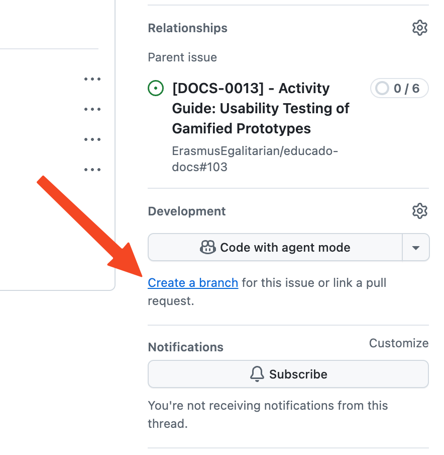
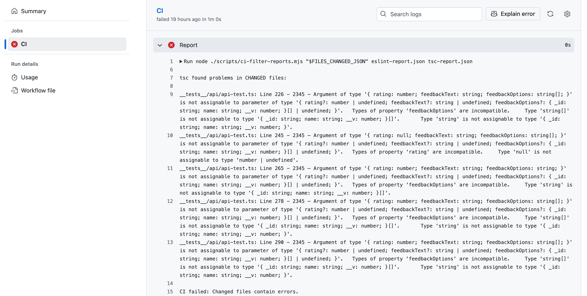
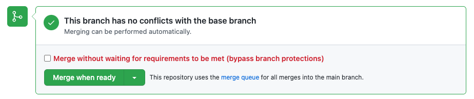

## Branching

Create a branch from `dev`. It is advised to use the `Create a branch` button in the GitHub Issue UI as it will name the
branch according to the issue you are working on.

{: style="height:300px"}

## Linear history

Keep your branch up to date. Do this **frequently**. There will be a lot of upstream changes (`dev` on GitHub) and you
want to make sure that your branch includes those changes even while you are working, and before you open a PR. In this
way, merge conflicts are reduced to a minimum, and the code you edit matches the latest version of the code. Run
`git fetch` frequently to check for upstream changes. If you see a line in the output that says that `origin/dev` has
been updated, you know it's time to rebase. Use `git fetch && git rebase origin/dev` to rebase your branch and resolve
merge conflicts locally using the WebStorm `Git | Resolve Conflicts` tool.

!!! danger

    When resolving conflicts, make sure you don't erroneously delete any code, and only add the code that you wrote.

## Formatting, linting and QA

### Prettier, ESLint and tsc

The GitHub workflow will run Prettier, ESLint and tsc to check your code for problems. You can run these checks locally
using the following commands:

```shell
# Will check for ESLint problems
npm run lint

# Will check for type errors
npm run tsc:check

# Will check if all files follow Prettier formatting style
npm run format:check
```

### CodeScene

Frequently check the
[CodeScene project](https://codescene.io/projects/44140/jobs/4588055/results?scope=month#code-health) for issues.

### QA

**Always** run the app locally using the emulator to check for any defects before opening a PR.

## Pull requests

### Opening a PR

Always select `dev` as the target branch. Request reviews manually from **two** reviewers: One from your team and one
from another team that is also working on the mobile app.

Create small PRs that are straightforward to review and merge. If you have a lot of changes, it is better to split them
into multiple PRs.

### CI

If the GitHub workflow fails, navigate to `Checks > CI > CI` from the PR page to check which step failed. Open the
failed step; you'll see output like this:

{: style="height:350px"}

If the `Report` step failed, it is because the workflow detected ESLint and/or tsc problems in the files y**ou have
worked on**. Run `npm run lint` and `npm run tsc:check` locally, and search for the files you worked on in the command
outputs to figure out which problems you missed, or use the built-in WebStorm `Problems` tool window.


Resolve the problems and push the changes to your branch. The GitHub workflow should now pass.

### Merging

Once your PR passes CI and gets two approvals, you can merge it. Do this by adding your PR to the Merge Queue by
clicking the `Merge when ready` button in the PR UI.

{: style="height:130px"}

!!! warning

    We allow **rebase** and **squash** merges. Use **rebase** when your branch history is clean and short. Use 
    **squash** when you have a lot of commits that you want to squash into one.
