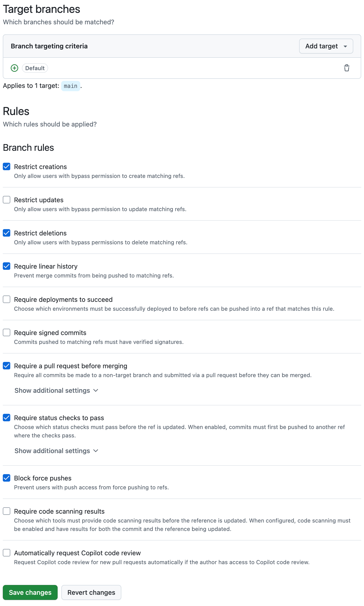

# Upgrade and Refactor of the Mobile Application

_By Martin Kedmenec_

## Introduction and Rationale

Upon starting up the three projects for the first time, the large amount of technical debt was immediately noticeable.
Looking at old branches and commits, it quickly became evident that the project hasn't really been updated for
at least two years, with some key dependencies not having been updated for three years.
Not only that, but the majority of the project still followed an old directory structure, used plain old JavaScript (not
TypeScript), and it was very clear that a multitude of conflicting programming styles has been used without any central
guidelines, to name a few.

As one of the project's goals is to launch on the Google Play Store, it is necessary to upgrade the project to the
latest versions of Expo and React Native.
According to
[Meet Google Play's target API level requirement](https://developer.android.com/google/play/requirements/target-sdk),
new apps must target Android 15 (API level 35), which would be impossible to achieve with the current state of the
project.

Outdated practices and tooling are also a major cause of bugs and quirks and are holding the project back from
reaching its full potential.

To make matters worse, continuing to build upon the outdated codebase **without** proper maintenance and upgrades is a
huge waste of time and effort.
This is because developers have to spend time merging code that might not even be possible to deploy and run anymore.

The question that immediately struck my mind was: **How can we fix this?**

## Initial Upgrade and Challenges

I started to experiment to figure out a procedure that would allow me to upgrade the project to the latest versions of
Expo and React Native.
Simply updating the project using `npm update` and `npm audit fix` doesn't work.
This is because not only have the dependencies not been updated, but the project also includes a lot of unused
dependencies that hold the other dependencies from being updated.
Some outdated tooling is used like e.g. `react-native-dotenv` (which is a two-year-old package) to manage environment
variables while a built-in solution exists in newer versions of Expo.
Such dependencies hold the other dependencies from being updated.
An older version of Nativewind is used to work with styles but cannot simply be upgraded as it requires new peer
dependencies.
These examples are just two of the many challenges that I encountered.

## A Proper Fix

To overcome the initial challenges, I knew that I had to take a more radical approach.
My procedure was to create a fresh new Expo project from the default template to look at its file structure and mimic it
in our repository.
I went through each directory and file in the template and moved the files in our project to match the target structure.
I copied `package.json` and `package-lock.json` from the template to our project, and then manually reinstalled only the
dependencies that we actually use by using the current `package.json` as a reference.
This often required me to find and read the official documentation of a given dependency to understand how to install
and configure it, as it's not enough to simply run `npm install`.
Here, especially Nativewind was challenging to install and configure.
The process was: Install one dependency, check if it works, fix issues, repeat.
This bottom-up approach allowed me to fix issues step by step as they arose, rather than trying to fix everything at
once.

I then changed the file extensions to `.ts` or `.tsx` where possible.
Some configuration files don't support TypeScript, so I left them as they were.
Already this small change made the TypeScript compiler and IDE linting tools kick in and check for type errors.
Luckily, TypeScript is mostly a development tool, so it's not a big deal to have some type errors in the code.
The code compiles and runs without issues, but IDEs show the type errors for other developers to fix.

Then I renamed all files to use kebab-case.
This is a common convention in the React ecosystem, and it makes it easier to find files and directories.
After that, I had to fix all the imports.

To overcome the messy formatting, I installed and configured Prettier and formatted all files.
Prettier is the golden standard for formatting JavaScript and TypeScript code, and because it's opinionated and
deterministic, no matter who writes the code, Prettier will always produce the same output.
This is a huge benefit for developers, as they don't have to worry about the formatting of their code.

I worked on a Dockerized solution to run the project locally, and it works.
It required me to write a custom `Dockerfile` which is based on the newest version of the Node.js image.
A `compose.yaml` file is then used to ease the setup of the project.
While I believe that Docker should be the preferred way to run the project in the future, I also added a `.nvmrc` file
to specify the Node.js version for the `nvm` tool.
This can be an alternative to Docker if some developers require it.

The following lists lay out many of the major changes that I did on my `refactor-and-upgrade` branch to improve the
project's codebase, but the full changes are available on my
[`refactor-and-upgrade`](https://github.com/ErasmusEgalitarian/educado-mobile/tree/refactor-and-upgrade) branch.

### General Best Practices

- Moved source files from `eml/` directory to project root.
- Changed the directory structure to follow the latest Expo structure while retaining the old source files.
- Added `.env.local.example`.
- Migrated all files from JavaScript/JSX to TypeScript/TSX, except files which cannot be migrated (e.g.
  `babel.config.js` and `metro.config.js`).
- Upgraded all packages to the latest versions that can be resolved.
    - The project is now running on the latest versions of key technologies (Expo 54 and Node.js 24 at the time of
      writing).
- Changed all relative imports to absolute imports.
- Removed `.gitlab-ci.yml`.
- Renamed `readme.md` to `README.md`.
- Removed redundant `import React from "react"`.
- Removed `prop-types` in favor of TypeScript's built-in type checking.
- Removed `react-native-dotenv`.
- Updated `.gitignore` to reflect the Expo standard.

### Common Platform and Style

- Added Prettier.
    - Added `.prettierc`.
    - Added `.prettierignore`.
    - Reformated all files (`.json`, `.yml`, `.js`,`.ts`, `.tsx`, `.md`).
- Added `.editorconfig`.
- Added `Dockerfile` and `compose.yaml`.
- Renamed all files to use kebab-case.
- Added `.nvmrc` to specify the Node.js version.
- Added project configuration for JetBrains IDEs.
- Added project configuration for Visual Studio Code.
- Converted all functions to arrow functions.
- Moved default exports to the bottom of the file (WIP).
- Converted random comments and docs to TSDoc (WIP).

## To Do

While I managed to do most of the above, there are still a few things that need to be done.
I managed to migrate some components to proper TypeScript, but not all of them.
A common issue is when components use the untyped `props` parameter, as it doesn't tell developers anything about what
data the component actually accepts:

```typescript
const StandardModal = (props) => { // What is `props`?
    // ...
}
```

I e.g. converted the `PasswordEye` component to TypeScript:

[//]: # (@formatter:off)
```typescript
const PasswordEye = ({
  toggleShowPassword,
  showPasswordIcon,
  testId,
}: {
  toggleShowPassword: () => void;
  showPasswordIcon: boolean;
  testId?: string;
}) => {
    // ...
}
```
[//]: # (@formatter:on)

These are just some examples of things that need to be done.
Here are some additional items that I noticed that need to be fixed:

- A couple of Jest tests had to be disabled as they were failing. Luckily, over 100 tests pass, so fixing the failing
  tests is not detrimental.
- Fully convert all source files to TypeScript and fix `tsc` errors.
  [//]: # (@formatter:off)
- Migrate tests from `react-test-renderer` to `@testing-library/react-native` (see [here](https://docs.expo.dev/develop/unit-testing/)).
  [//]: # (@formatter:on)
- Use proper English and Brazilian Portuguese localization (see [here](https://docs.expo.dev/guides/localization/)).
- Migrate `app/index.tsx` to Expo Router.
- Fix all ESLint errors and warnings.
- Fix GitHub Workflows to reflect the new improved Expo tooling.
- Double and triple check whether the Expo configuration is correct. Especially pay attention to and lock the Android
  version used by the clients in the configuration.

## Future Issues and Challenges

The biggest challenge in this approach is that the changes are so big that it will be challenging to review.
At the time of writing, the `refactor-and-upgrade` branch is showing 459 changed files with 67,654 additions and 80,503
deletions.
Of course, a lot of this is due to the updates in `package-lock.json`, but because I also reformatted all files, and
moved them out of `eml/` into the project root, so the number of changes is very high.
As we are still in the early stages of this year's project, I don't believe it will be a problem.
I also strongly believe that it's much easier to use this as a starting point and then fix individual bugs and quirks
as they arise: Migrate and upgrade first, then fix bugs in small batches, rather than try to fix bugs now and get stuck
with the upgrade later.

## Branching and Versioning Strategy

I also noticed that the project's repositories follow the Gitflow branching strategy.
This might have been a good strategy at some point, but it's not necessarily anymore.
The project suffers from one of the major problems of Gitflow: Development branches are always way ahead of `main`.
To mitigate this problem, increase development velocity, maintain consistency, a clean history, and deliver small but
incremental value to the stakeholders, I propose to switch to
[trunk-based development](https://trunkbaseddevelopment.com/).
While a full rundown of TBD is out of the scope of this document, I will attempt to explain it quickly.
With TBD, the project would have a single `main` branch, and all development would be done on `team` and `feature`
branches.
Those branches would be merged into `main` using pull requests on a very regular basis&#151possibly daily.
The `main` branch would be used as a single source of truth, and all other branches would branch from it with changes
merged back into it.
This process forces teams to work on small, well-defined features and to deliver small but incremental value to the
stakeholders.
As everything is merged into `main`, every PR needs to be of high quality and well-tested.
The result is that no work gets lost: Every positive change is released.

The branches also severely lack GitHub rulesets that lock certain branches and operations.
Currently, everyone can just push to `main`, and `dev` is actually the branch that is ahead.
I believe that this is a major problem, and I propose to set up proper branch rulesets.

I suggest a ruleset similar to the one below, but possibly with more restrictions:



A versioning strategy is also important.
I propose to use [Semantic Versioning](https://semver.org/) with automatic version update on every GitHub Release.
This is a good practice to follow, as it allows developers to easily understand what changes have been made between
versions.

## Recommendations

My experiments show that it is indeed possible to upgrade and refactor the existing project if great care is taken.
Discipline is key.
To sum up, here are my recommendations:

1. Continue using the `educado-mobile` repository as it's maintainable, as long as the upgrade changes are merged.
2. Merge `refactor-and-upgrade` into `dev` as soon as possible, so that everyone can benefit from the new setup.
3. Reset `main` to be a copy of `dev` after the upgrade.
4. Continue development using trunk-based development. Communicate the branching strategy to all teams.
5. Set up proper GitHub branch rulesets.
6. Incrementally, but with high velocity, fix the project's individual bugs and quirks.
7. Release **often** and keep the value.
8. Tighten CI/CD pipelines to prevent bugs from being introduced.
9. Use a proper versioning system ([Semantic Versioning](https://semver.org/)) with automatic version update on every
   GitHub Release.
10. Attempt similar procedures for the other projects.
11. Let developers fix `tsc` errors and ESLint warnings as we go.
12. Briefly suspend development on the mobile app until the upgrade is complete.
