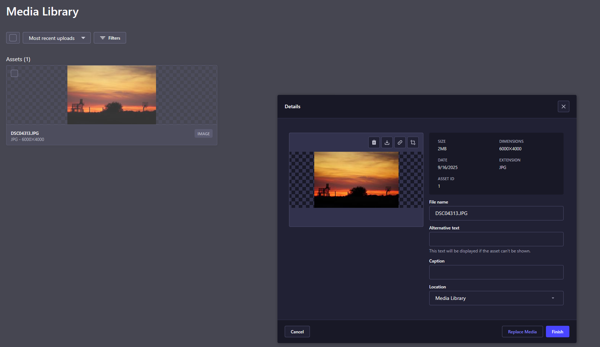
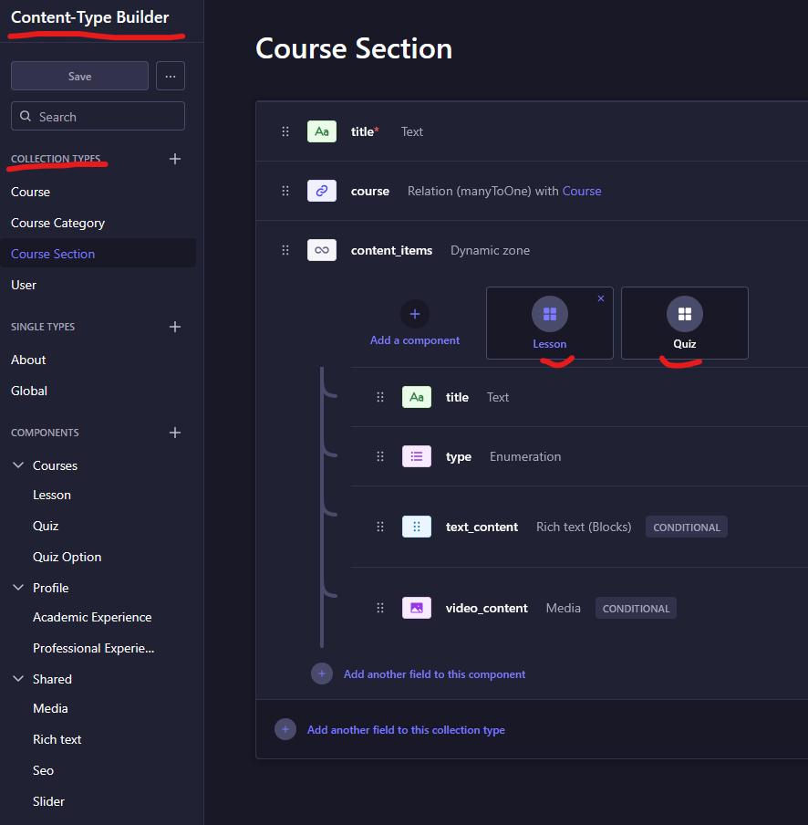
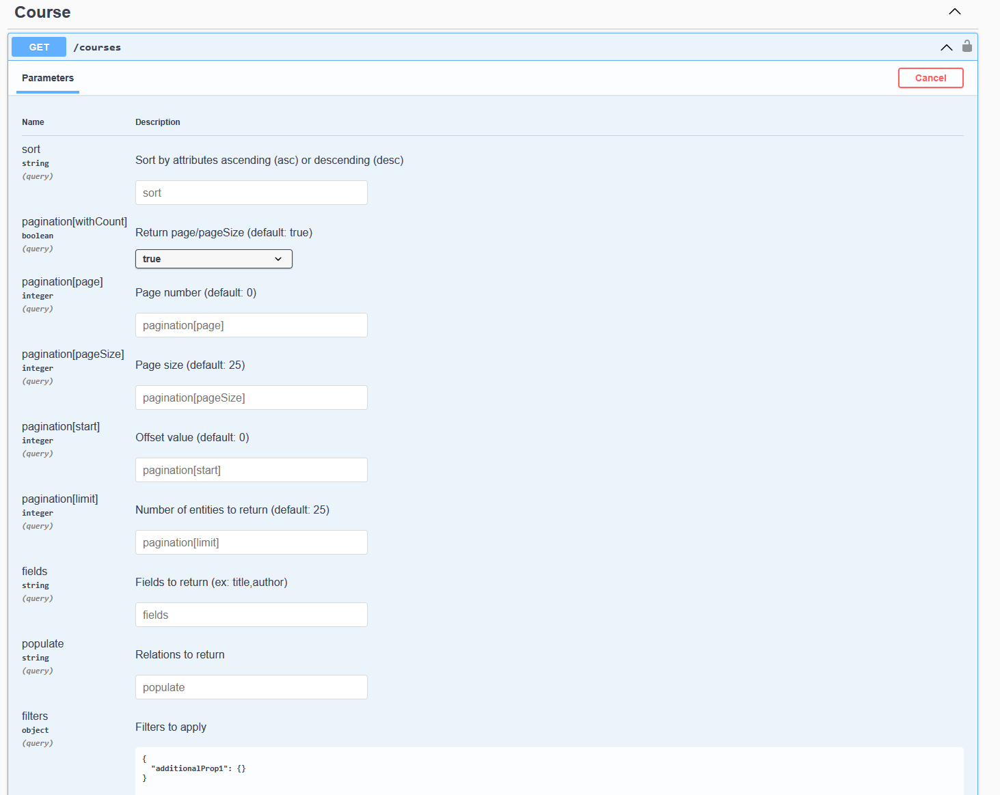
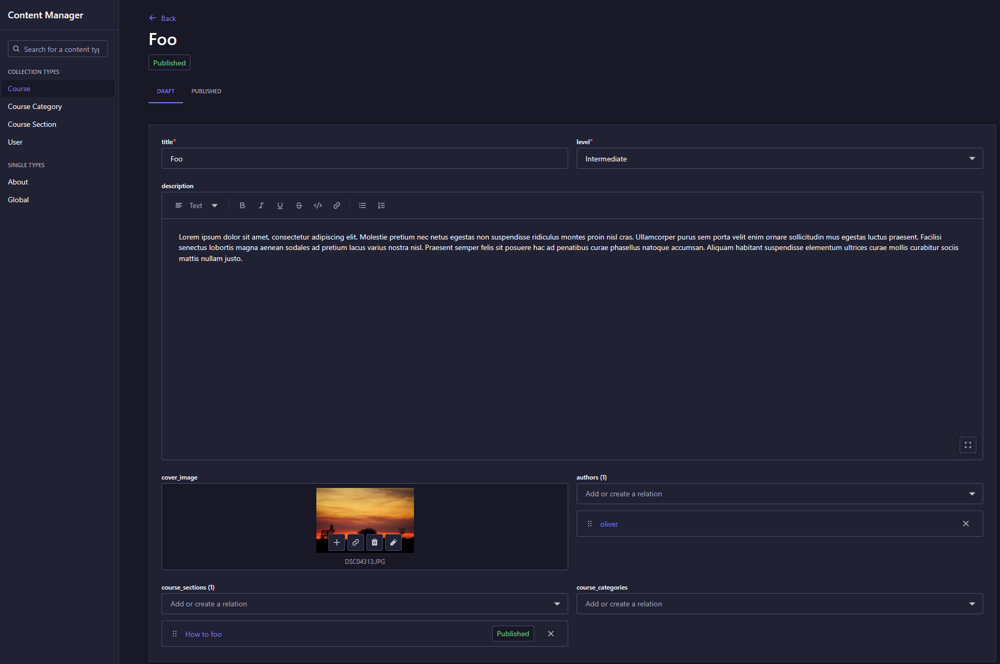
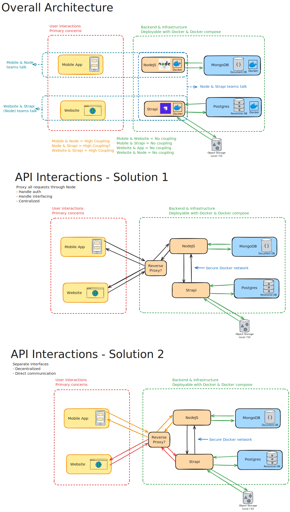

# Platform Evaluation Report: Strapi for Content Creation

# 1. Summary
This report documents the research, analysis, and test implementation of Strapi as a headless CMS for our content creation platform. The evaluation confirms (IMO) that Strapi is a robust, flexible, and developer-friendly solution that meets all critical project requirements. The original motivation was to reduce backend development workload to accelerate the delivery of user-facing features, and Strapi directly achieves this.

**Recommendation:** Based on the findings, I recommend adopting Strapi as the backend for our content platform. It provides a powerful and stable feature set out-of-the-box, significantly reducing development time and allowing the team to focus on building a high-quality user experience.

---

## 2. Introduction: What is Strapi?

**Strapi** is an Open Source, headless Content Management System (CMS). A traditional CMS bundles the content backend with a specific frontend for display. A **headless CMS**, which is what we require, focuses solely on the backend. It stores and organizes content, making it available via an API to any consumer, such as our mobile app and web frontend. It is important to note that Strapi is a content platform, not a full Learning Management System (LMS) like Moodle.

---

## 3. Core Findings & Analysis

My findings are based on a test implementation where I deployed and configured a Strapi instance. Afterwards, i began modelling courses and user profile structure as defined in the Figma prototypes. This was an easy task, and it showed that we can model the requirements in Strapi.

### 3.1. Key Features for Content Management

Strapi includes numerous features critical to our project goals, which we would otherwise need to build and maintain ourselves.

*   **Draft & Publish System:** This is a built-in feature that can be enabled per content type. It allows content creators to work on drafts incrementally and only publish them when ready. The API can be configured to only deliver published content to the end-users, which is an essential feature in publisher workflows.
*   **Media Library:** A comprehensive solution for asset management.
    *   **Full CRUD API:** All assets can be programmatically uploaded, modified, and deleted.
    *   **Web UI for Management:** The admin panel includes a visual media library for easy manual management. This allows administrators to browse, edit metadata (alt text, captions), and organize assets without needing developer intervention, simplifying long-term maintenance.
    
    *   **Format Support:** Natively handles images, video, audio, and other files.
    *   **Optimization:** Provides automatic asset optimization, including compression and the generation of responsive formats (small, medium, large), which is crucial for performance on low-end devices.
    *   **Provider Support:** Supports local storage for development and can connect to cloud providers like AWS S3 for production.
  
*   **Internationalization (i18n):** Strapi provides built-in support for managing content in multiple languages, which could be a significant strategic advantage for future growth.


### 3.2. Flexible Content Modeling (The Content-Type Builder)

The Content-Type Builder is a powerful visual interface within the admin panel for defining our data schemas. This was a standout feature during testing.

*   **Visual Schema Design:** It allows developers to create complex data structures with relations, components, and various field types (Text, Number, Media, JSON, etc.) without writing SQL or manual migration scripts. Strapi handles all database management automatically.
*   **Component-Based Architecture:** I was able to create reusable "Components" (like `quiz_option`) and nest them within larger structures. I also leveraged "Dynamic Zones" to create flexible layouts where content creators can mix different types of content (e.g., `Lessons` and `Quizzes`) within a `Section`. This perfectly matches the Figma prototype's requirements. It also allows for flexible future enhancements.


*As seen above, a `Course Section` is modeled with a title, a relation to a `Course`, and a Dynamic Zone (`content_items`) that can contain a mix of Lessons or Quizzes.*

### 3.3. Developer Experience

Strapi is highly developer-oriented and integrates seamlessly into modern workflows. It is also written in JS/TS, which fits our current stack in comparison with Moodle which is written in PHP.

*   **API Self-Documentation:** The platform can auto-generate an OpenAPI (Swagger) specification for the entire API. This creates interactive, self-updating documentation where developers can test endpoints directly from their browser, ensuring the documentation is always in sync with the actual API.
*   **Type-Safe Client Generation:** The OpenAPI specification allows us to auto-generate a fully typed TypeScript client. This enforces data consistency between the frontend and backend, eliminating a common source of bugs and significantly improving developer productivity. It also disallows a couple of bad habits developers could have, maintaining their own types and API interactions.

```typescript
// Example: A generated client ensures type safety and reduces boilerplate as seen from a developer (Not Strapi example, but the concept applies. Strapi can do alot more)
import { CoursesApi, CourseResponse } from "@/api";

export const fetchCourse = async (courseId: string): Promise<CourseResponse> => {
  const coursesApi = new CoursesApi(customConfiguration);
  const course = await coursesApi.findCourseById({ id: courseId });
  return course;
};
```




#### 3.3.2. Powerful & Flexible Data Querying
Strapi's query engine allows frontend developers to tailor API responses to their exact needs without requiring custom backend endpoints.

*   **Advanced Filtering:** Filter content based on any field, including fields in related models (e.g., `filters[level][$eq]=Beginner`).
*   **Deep Population of Relations:** Control which related data is returned in a single request to avoid multiple API calls (e.g., `populate[sections][populate][content_items]=*`).
*   **Sorting, Field Selection, and Pagination:** Full support for sorting by any field, selecting only the necessary data to reduce payload size, and out-of-the-box pagination for handling large datasets.
  

### 3.4. Administrative Tools (Content Manager)

While the goal is to build a custom frontend for content creators, Strapi's built-in Content Manager provides immense value for developers and administrators. It serves as a "raw" data browser, allowing for quick data entry for testing, debugging, and administrative oversight. Access is controlled by a granular roles and permissions system.



## 4. Architectural Analysis

Integrating Strapi introduces a service-oriented architecture. The infrastructure can be fully managed via Docker and Docker Compose. We analyzed two primary models for API interaction.

*   **Overall System:** The ecosystem will consist of the Mobile App and a new Website frontend, supported by the existing NodeJS backend and the new Strapi backend.




### Solution 1: Centralized Proxy via NodeJS

In this model, the NodeJS backend acts as the single gateway for all clients (Mobile App and Website). It handles all authentication and business logic, proxying content-related requests to Strapi over a secure internal Docker network.

*   **Pros:**
    *   **Centralized Control:** All authentication, authorization, and business logic remain in one place.
    *   **Enhanced Security:** Strapi is not directly exposed to the internet; only the NodeJS backend can communicate with it.
    *   **Future-Proof:** If Strapi were ever replaced, only the interface within NodeJS would need to be updated, making the system highly adaptable.
*   **Cons:**
    *   **Higher Coupling:** The NodeJS backend becomes a bottleneck and is tightly coupled to both frontend clients and Strapi.

### Solution 2: Decoupled Direct Communication

In this model, each frontend communicates directly with the service it needs. The Mobile App talks to NodeJS, while the Website (for content creation) talks directly to Strapi. A reverse proxy (like Traefik) routes traffic accordingly.

*   **Pros:**
    *   **Decoupled & Scalable:** Teams can work independently. The Website team doesn't need to depend on the NodeJS team for content features.
    *   **Simplified Services:** Each backend service has a clearer, more defined responsibility.
*   **Cons:**
    *   **Decentralized Logic:** Authentication and authorization logic might need to be managed in two places (NodeJS and Strapi), increasing complexity.

### **Recommendation:**

**Solution 1 (Centralized Proxy)** is the recommended approach. It provides superior security and long-term maintainability by creating a single, well-defined interface to our content layer. This aligns with best practices for microservice architecture and simplifies authentication management significantly.

---

## 5. Pros and Cons Summary

| Pros | Cons |
| :--- | :--- |
| ✅ **Accelerated Development:** Leverages a fully functional backend designed for content management. | ❌ **New Dependency:** Adds a new, large system to learn, manage, and maintain. |
| ✅ **Rich Feature Set:** Includes media library, draft/publish, roles, i18n, etc., out-of-the-box. | ❌ **Additional Database:** Requires a relational database (Postgres) in addition to our existing MongoDB. |
| ✅ **Excellent Developer Tooling:** OpenAPI/Swagger support and type-safe client generation streamline integration. | ❌ **Potential Overkill:** The platform has more features than we may immediately need. |
| ✅ **Flexible Data Modeling:** The Content-Type Builder is powerful and intuitive. | ❌ **Custom Frontend Required:** The native admin UI is not sufficient for our end-user (content creator) goals. |
| ✅ **Docker-Based Deployment:** Integrates easily with our existing infrastructure. | |
| ✅ **Open Source & Active Community:** Strong community support and no licensing fees. | |
